# Socket-Poker
Multiplayer card game

<i> powered by Java Sockets</i>

## Demo

<figure class="video_container">
  <video controls="true" allowfullscreen="true" poster="demo/screenshots/main_menu_0.png">
    <source src="demo/demoreel.mp4" type="video/mp4">
  </video>
</figure>

### Intro

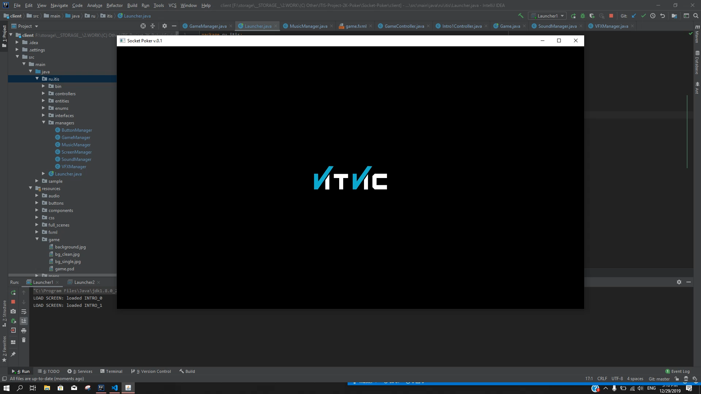
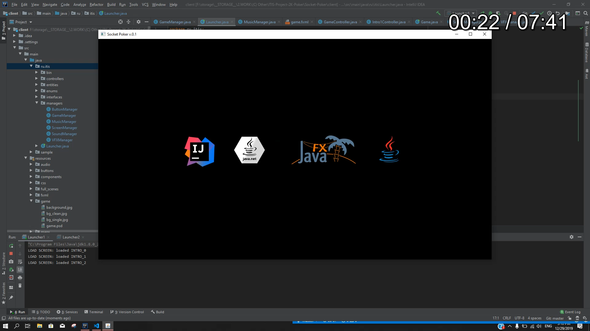
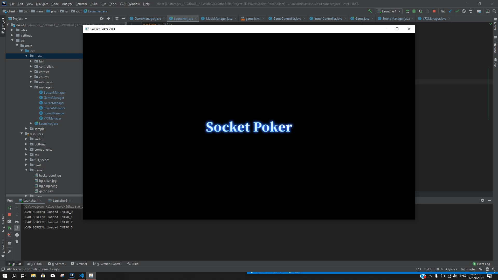

### Main Menu
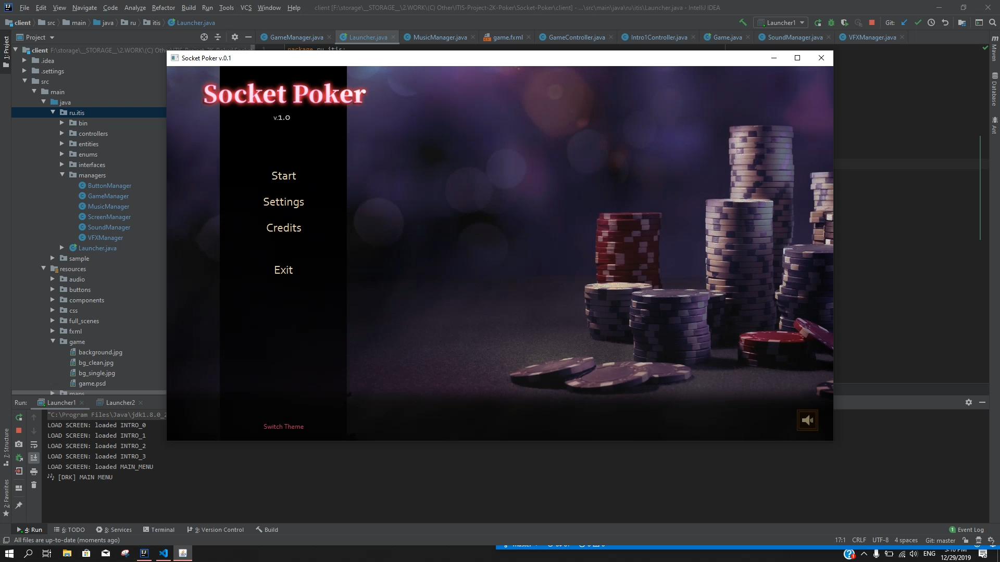
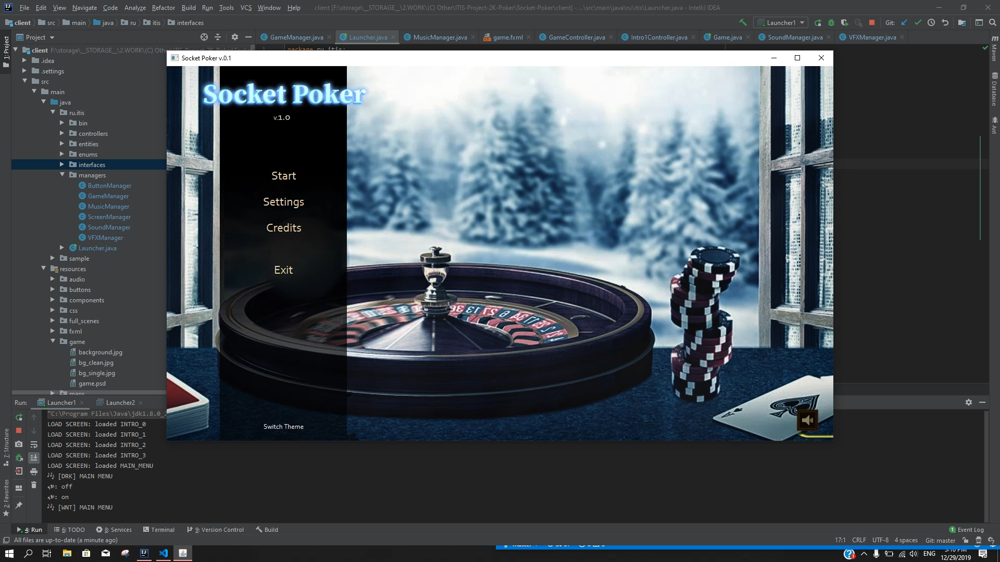
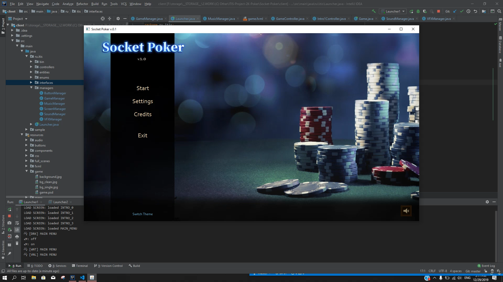
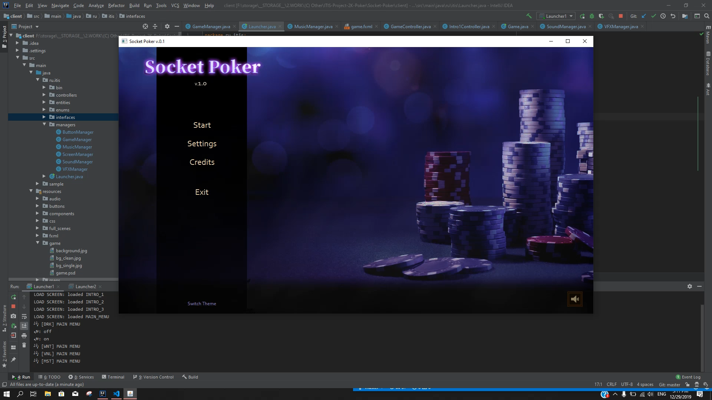

### Game 

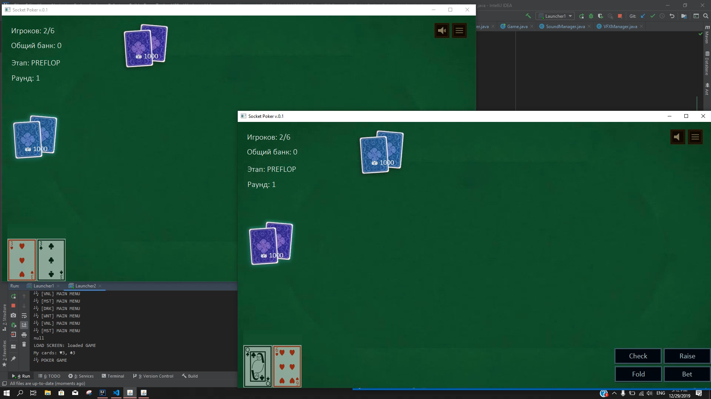
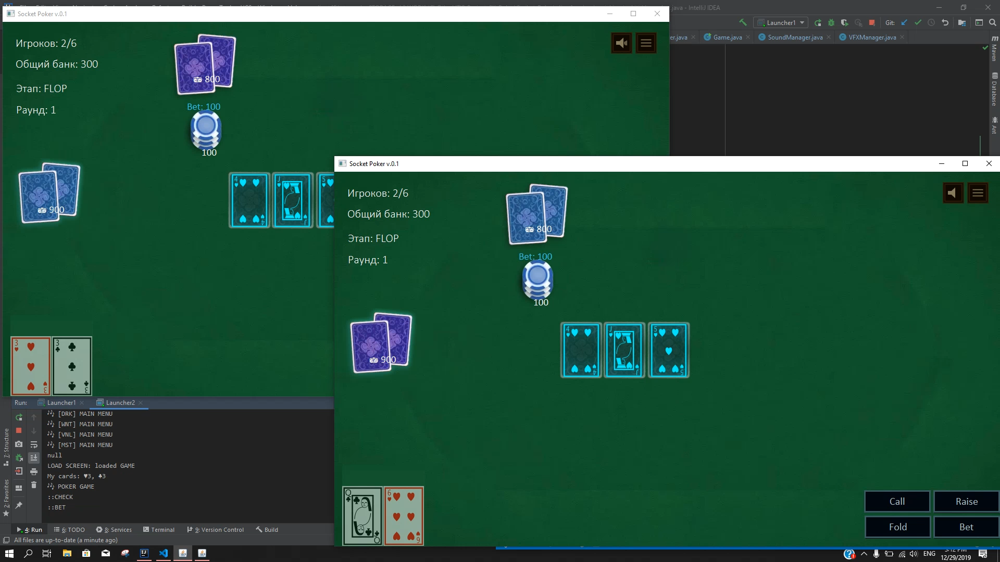
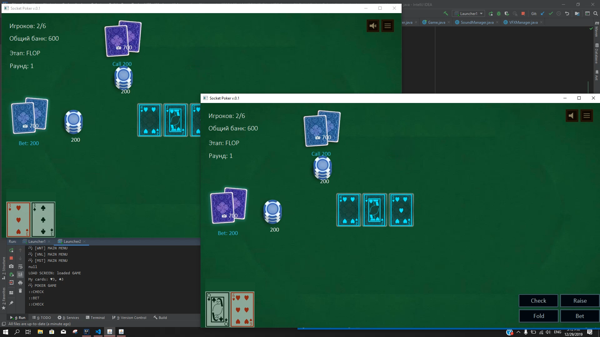
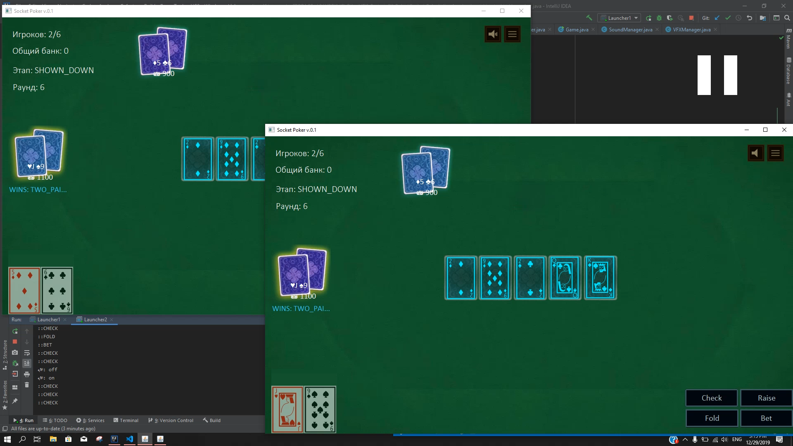
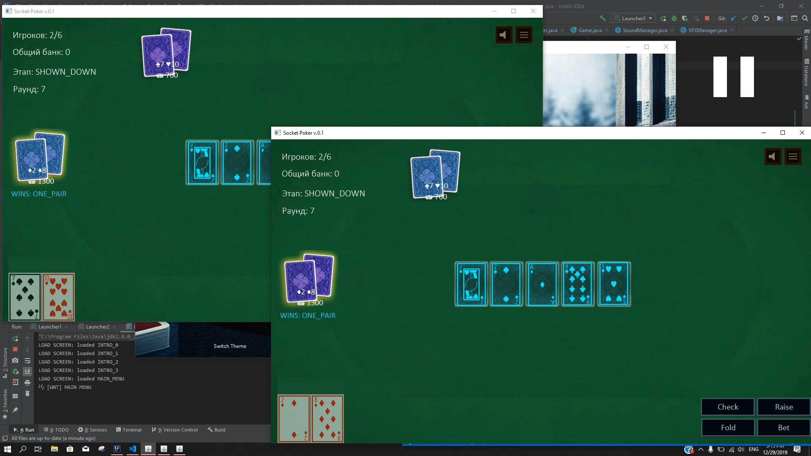
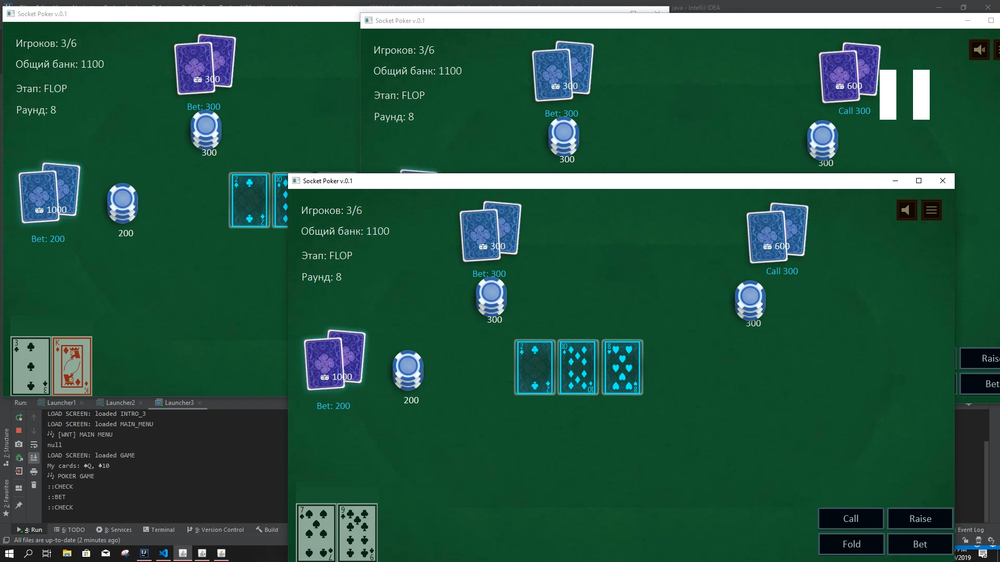
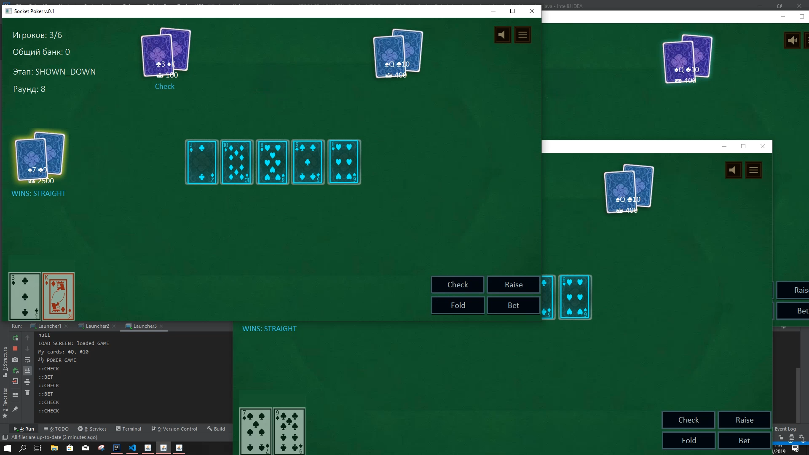
